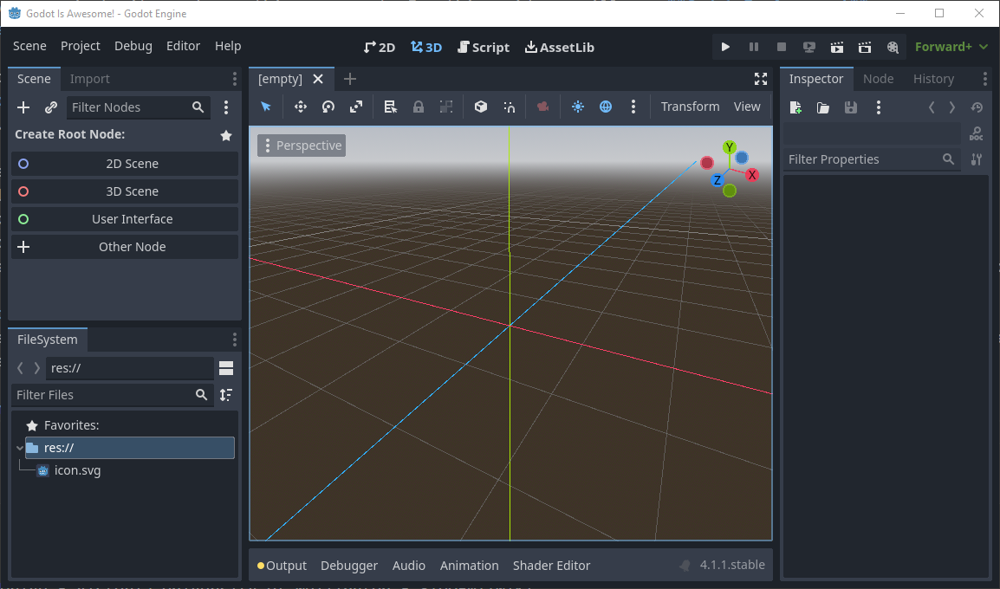
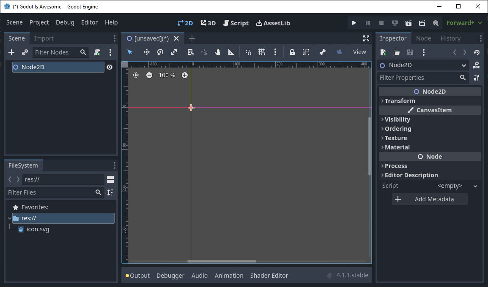
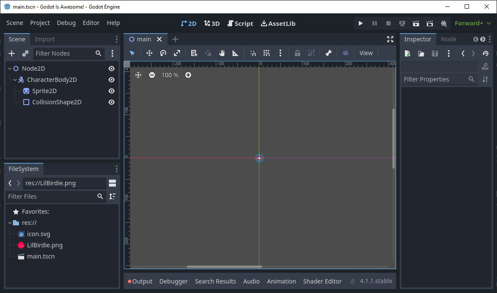
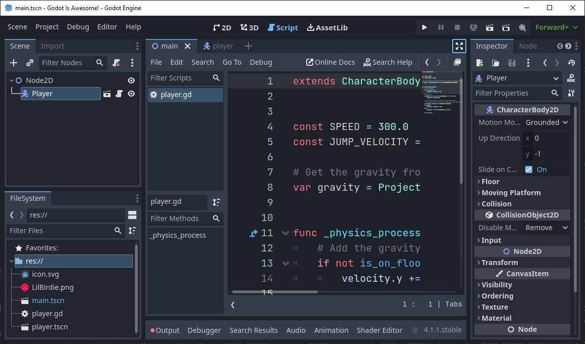

[Godot](https://godotengine.org/) is a free and open source game engine that supports game design for 2D and 3D games. It is a great tool for beginners and experts alike. It is also a great tool for teaching game design and programming. This guide will help you get started with Godot and teach you how to make a simple 2D game.

This guide is up-to-date with Godot 4.1.1 stable official release.
# Getting started
There are several options for developing with Godot. The recommended way is to download the latest version from the [downloads page](https://godotengine.org/download/) for Windows/macOS/Linux. It will be what we use for this guide.

- Run the engine in a web browser with the [Godot Web Editor (v4.1.1)](https://editor.godotengine.org/releases/4.1.1.stable). This is the easiest way to get started, but it has [documented limitations](https://docs.godotengine.org/en/stable/getting_started/editor/web_editor.html#limitations) and is not recommended for large projects.
- Download the android app from the [Google Play Store](https://play.google.com/store/apps/details?id=org.godotengine.editor.v4), while functional it is in early access and may not be stable.
- (Recommended) Download the latest version from the [downloads page](https://godotengine.org/download/) for your platform to run locally. Extract the zip file and run the executable. You should see a window similar to this:

A version of the engine that uses C# is also available. It is not recommended for beginners, but if you are familiar with C# it may be a better option for you. You can download it from the [downloads page](https://godotengine.org/download/) for your desktop platform. However, it is not available for use in the web editor or the android app. 

## Creating a project
### Making a new project
Click the **New Project** button to create a new project, the following window will appear:

**Project Name:**
This is the name of your project, it can be anything you want. For this guide, we will use **Godot Is Awesome!**.
You can use the **Create Folder** button to create an empty folder with the name of your project at the project path.  
**Project Path:**
This is the path to the folder where your project will be stored.
You can use the **Browse** button to select a folder or type in the path manually.
It is recommended you use an empty folder for your project.  
**Renderer:**
Godot has three renderer presets: Forward+, Mobile, and Compatibility.
For this guide, we will use the **Forward+** preset.
Forward+ is only good for desktop platforms and has the most features.
Mobile is best for mobile platforms, but supports desktop, and has fewer features with better performance.
Compatibility supports desktop, mobile, and web platforms, it has the fewest features and the best performance. It is not recommended to use compatibility for 3D projects.  
**Version Control Metadata:**
This is used to store version control information in the project folder. It is recommended to leave this on Git even if you are not using version control. It is also recommended to use version control for your projects, but it is not required.  

### 2D or 3D?
The next window that'll open is the meat of the game engine, it is where you make your actual game. At first, it can be a little daunting, all the buttons and docks, but it's simple to understand once you've used it a bit.

For now, decide if your project will be 2D or 3D. You can change this later, but it's easier to start with the right one for your project.
For this guide, we will use 2D to introduce all the key concepts.  

### The interface
The interface is made up of several docks and buttons. The most important ones are the Scene dock (top left), the Inspector dock (right), and the FileSystem dock (bottom left).  

The four main screens of Godot are the 2D screen, the 3D screen, the Script screen, and the AssetLib screen. You can switch between them with the buttons in the top of the screen.

## Components of a game
In the top left under **Create Root Node:** click the **2D Scene** button. This will create a new scene with a **Node2D** root node.

This should be the core scene of your game, or the scene that you do the core of your development in.  
At any time save your scene with **Scene > Save Scene** or save all scenes with **Scene > Save All Scenes**, we saved the scene as **main.tscn**.

### Nodes
Nodes are the building blocks of your game. They are the objects that make up your game. They can be anything from a sprite to a camera.
Nodes are organized in a tree structure, with the root node at the top and child nodes below it. Nodes can have any number of child nodes, but only one parent node.
You can see all the types of nodes with the Add Child Node button in the top left of the Scene dock, or by right-clicking any node in the Scene dock and selecting **Add Child Node**.  
It's worth taking a look at your options, but for now we'll start with CharacterBody2D. It can be hard to find since it's nested inside several nodes, but you can search for it in the bar. 

The CharacterBody2D is a node designed for objects that interact with physics that will be controlled by the player.
You'll notice it has a warning icon next to it, go ahead and add both the Sprite2D and CollisionShape2D nodes as children to the CharacterBody2D node.  
Now the CollisionShape2D node has a warning icon, this is because it needs a shape to define its collision. On the right side of the screen you'll see the Inspector tab, this is where you can edit the properties of the selected node. Select the CollisionShape2D and change the first property, the shape, to a **New CircleShape2D**.

Similarly, on the Sprite2D node, you can change the texture property to a new texture. Save the little birdie image below to your device with **right-click > Save Image As...** and drag it into the FileSystem tab in the bottom left of the screen, alternatively you can make your own image and use that. Once it's in the FileSystem tab, you can drag it into the texture property of the Sprite2D node. 

If you want to make your own pixel art similar to this to expand your game later, use the [PICO-8 palette](https://lospec.com/palette-list/pico-8).

Your scene should now look something like this:

In the viewport, the largest area of the screen that shows the scene, you can move around with the middle mouse button and zoom in and out with the scroll wheel.
Zooming into the small circle where the red and green lines meet, you might notice the pixelated texture is fuzzy. This is because the texture is being scaled up to fit the size of the sprite. To fix this, go to the Sprite2D node and change the property **CanvasItem > Texture > Filter** to **Nearest**. Only do this for pixel art textures.
In the future if you do not want to change the Filter property for every Sprite2D node, you can change any parent node's Filter property to Nearest and all child nodes will inherit it if their Filter property is set to Inherit.

### Scenes
Scenes are collections of nodes that make up a part of your game. They can be anything from a single node to a complex hierarchy of nodes. Scenes can be saved as files and reused in other scenes.

For example it's good practice to have your player character in its own scene, so you can reuse it in other scenes. This is especially useful if you have multiple levels in your game, you can reuse the player character scene in each level scene. You can convert the current CharacterBody2D node into a scene by right-clicking it and selecting **Save Branch as Scene**. Save it as **player.tscn**, also rename the node from **CharacterBody2D** to **player** by double clicking the name. Now if you want to edit the child nodes of your player character, you can open the player.tscn scene by clicking the new **Open in Editor** button next to the player node in the Scene tab. You can also open the scene by double clicking the player.tscn file in the FileSystem tab.

Go ahead and open the player scene and add the Camera2D node as a child to the CharacterBody2D node. This will make the camera follow the player character. You can also turn on **Position Smoothing > Enable** in the Camera2D node's properties to make the camera movement smoother. Save the player scene. Above the viewport you can go back to the main scene by clicking the tab called the name of your main scene. 

Start your magnificent game by clicking the **Run Project** button in the top right of the screen or by pressing F5. You should see a window like this:

Press **Select Current** if you are in your main scene. Now your gorgeous game should be running! Let's get some interaction in there.

### Scripts
Scripts are what make your game do things. They are written in GDScript, a language similar to Python if you squint hard enough.
As mentioned before, you can write scripts in C# as well, but it is not recommended for beginners. If you are familiar with C# you can use the [C# documentation](https://docs.godotengine.org/en/stable/tutorials/scripting/c_sharp/index.html) to help you write your scripts.

To add a script to a node, select the node and **right-click > Attach Script** or press the **Attach a new or existing script to the selected node.** button above the hierarchy. For now, add a script to the player node, it will open a new window that looks like:

**Language:**
This is the language you want to write your script in, for this guide we will use GDScript and it will most likely be the only one you have available.  
**Inherits:**
This is the class that the script will inherit from, the player should inherit from CharacterBody2D.  
**Class name:**
Seemingly it does not change nor can you change it. Unsure as to its purpose.  
**Template:**
This is a template for the script, often you might want to the default node or empty object, but for this character we will use the **CharacterBody2D: Basic Movement** template since it has basic functions you might want for your player already setup.  
**Built-in Script:**
Built in scripts don't make a seperate file for the scripts, they are stored within the node. This is useful for small scripts that you don't want to make a seperate file for just to keep things clean, but it is not recommended for larger scripts or scripts that will be used by multiple nodes. For the player, we will not use a built-in script.  
**Path:**
This is the path to the script file. If you are not using a built-in script it will be replaced by a **Name:** field. For the player, we will use the default path `res://player.gd`. It is a good idea to make a folder just for scripts or just for scenes to make organization easier, but for this small project this is easier.

Click **Create** and you should see a new script window open. It should look like this:

You can make the script take up the whole window with the fullscreen icon in the top right, and if you have a console open you can close it by pressing **Output** at the bottom of the screen.